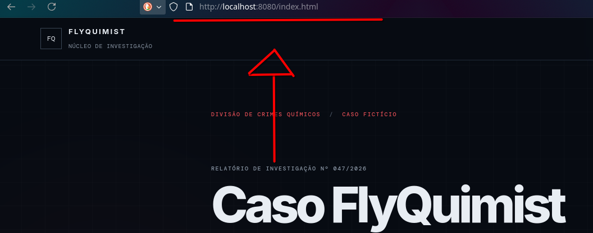

# Caso FlyQuimist
site dedicado a semana do industrial, um site resposivo com api's e html e css responsivo.


# Stack

- Java: 21
- Springboot:4.1.0
- mySQL server: 22
- Docker Compose
- html5
- css3

# Como rodar o container

1. Iniciar o container docker:
para iniciar o container docker, vá na raiz do projeto entre no prompt de comando e digite os seguintes comandos:

```bash 
docker compose up -d

docker ps
```

se aparecer algo como:

```bash 
morgan@debian:~/Projects/Job-do-industrial$ docker compose up -d
[+] up 1/1
 ✔ Container sherlock Running                                                                           0.0s
 
morgan@debian:~/Projects/Job-do-industrial$ docker ps
CONTAINER ID   IMAGE                                        COMMAND                  CREATED          STATUS          PORTS                                         NAMES
0d3aacf913b4   mcr.microsoft.com/mssql/server:2022-latest   "/opt/mssql/bin/laun…"   16 minutes ago   Up 16 minutes   0.0.0.0:1433->1433/tcp, [::]:1433->1433/tcp   sherlock
```
logo o container foi iniciado com sucesso!


2. Entrando no banco de dados por linha de comando: (caso o banco exista!)
```bash 
docker exec -it sherlock /opt/mssql-tools18/bin/sqlcmd   -S localhost   -U sa   -P '*123456HAS*'   -C 
```
se aparecer algo como:
```bash 
1>
```
você entrou no banco de dados por linha de texto!!

*obs: se você está rodando a aplicação do windows, vale olhar e ver a documentação do docker em relação aos comandos de inicialização como "docker exec it ..."*

*obs: caso esteja usando o sql server, é so fazer o processo de login no banco de dados após iniciar o container pela aplicação!*


# Acessar as rotas do site:
Para acessar o sites dentro do projeto é simplesmente ir no seu navegador de preferencia e colocar o endereço na barra de pesquisa:

